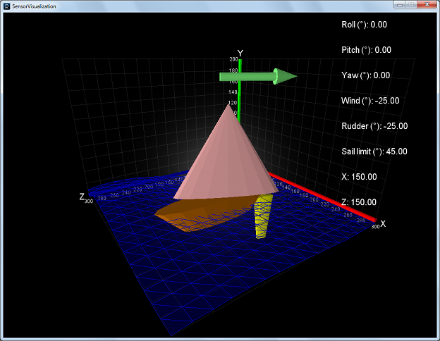

# SensorVisualization



This program displays a 3D visualization of a RoboSail sailboat's sensor values, including roll, pitch, yaw, (from the accelerometer) and wind direction (from the wind direction encoder). It reads the values through the serial port, and is made to work with the RoboSail Arduino programs.  It is intended to be used a tool to aid in writing and debugging code on the RoboSail Arduino processor.

It could also be useful for demos to advertise the RoboSail program. In the future, it would be neat to be able to visualize the data from the on-the-water RoboSail boats, either in real-time with something like a ZigBee radio, or with data recording/playback.

*NOTE: As of yet, this has not been tested with real RoboSail Arduino output, and in fact there will need to be some minor edits to the current serial output of the RoboSail Arduino code. (These edits were not made yet in the interest of leaving the Arduino code "untouched" for now.) There will likely also be corresponding edits needed to RoboSailSerialParser.pde. In the meantime, this software has been written/tested alongside an Arduino with a joystick shield (https://www.sparkfun.com/products/9760), running simple software to output joystick information over a serial port, somewhat emulating a real RoboSail device's output.*

## Requirements
This program runs on Processing version 1.5.1, which can be downloaded from:

https://processing.org/download/

*NOTE: Later versions of Processing currently are not supported due to graphical problems. (See TODO list.)*

## How to Run
1. Open SensorVisualization.pde in Processing.
2. Modify the 'comPort' string at the top of the source code to reflect the serial port you would like use for input from the RoboSail sailboat's Arduino (or from an Arduino joypad device).
3. Depending on your input device comment/uncomment the appropriate lines in the setup() function for the initialization of the serialParser variable:
```
  serialParser = new JoypadSerialParser(this, comPort); // for debugging/writing without equipment
  //serialParser = new RoboSailSerialParser(this, comPort); // must be after size()
```
4. For testing purposes, the program is currently set up to rotate the angle of the wind and rudder continuously. If using real serial input from a RoboSail device which supplies wind and rudder angles, you should disable this behavior by removing the call to debugTests().
3. Click the "play" icon in Processing.
4. Use the mouse to rotate the view of the scene.

## Angles 
Angles of the rudder, sail, and wind sensor on the sailboat are expressed like this:

            (overhead view)
                   /                    ^ 90 degrees
            ,,----/-------/             |
      bow  <     +      + |  stern      +----> 0 degrees
            ``------------+             |
                                        v -90 degrees


## TODO list
* finalize RoboSail/SensorVisualization communication protocol (human-readable-text-parsing or not? baud rate?)
* test with real RoboSail device
* better-looking boat
* support for Processing 3: textMode(SCREEN), water transparency, axes labelling
* 2D overhead view of angles?
* read in from recorded file? support for data via ZigBee?
* show GPS coordinates
* animate location of sailboat based on GPS coordinates, show historical path
* show compass direction?